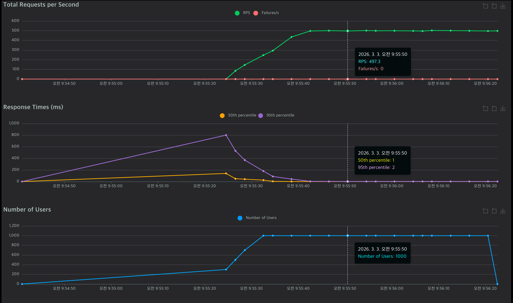

# OptiServe: A/B Testing & Recommendation Engine Backend

> **"대규모 트래픽 처리를 고려한 A/B 테스트 및 추천 시스템 백엔드 아키텍처"**
> 머신러닝 추천 모델을 서빙하고, 캐싱(Caching)과 비동기 백그라운드 로깅(Async Logging)을 도입하여 병목을 해결했습니다. 또한 Docker 컨테이너화를 통해 Production-Ready 배포 환경을 구축한 Full-Cycle 데이터/백엔드 시스템입니다.

     

## 프로젝트 개요 (Overview)
* **목표:** 머신러닝 추천 모델의 성능(CTR)을 검증하기 위한 A/B 테스트 인프라 구축 및 API 성능 최적화.
* **기간:** 2026.02.22 ~ (진행 중)
* **역할:** 백엔드/데이터 엔지니어링 (API 서빙, 비동기 로깅 파이프라인, 캐싱 고도화, ML 모델 연동, A/B 대시보드)

## 시스템 아키텍처 (System Architecture)
1. **Routing:** `Hashlib(MD5)`을 통해 유저 트래픽을 일관된 A/B 그룹으로 분산.
2. **Serving & Caching (성능 최적화):** Model A/B 연동 및 `lru_cache`를 통한 In-Memory 캐싱.
3. **Async Logging (병목 해결):** FastAPI `BackgroundTasks`를 활용한 비동기 로깅 및 Python `logging` 기반 서버 모니터링 추적.
4. **Analysis & Dashboard:** 카이제곱 검정(Chi-Square) 기반 승자 검증 및 `Streamlit` 실시간 대시보드.
5. **Infrastructure (배포/안정성):** Exception Handling(`try-except`)을 통한 예외 처리 및 `Docker` / `docker-compose`를 활용한 컨테이너 오케스트레이션.
6. **CI/CD & Test Automation (자동화/유지보수):** `pytest`를 활용한 API 엔드포인트 무결성 검증 및 `GitHub Actions`를 도입하여 Push 시 자동으로 테스트가 수행되는 CI(Continuous Integration) 파이프라인 구축.
7. **Performance Optimization (부하 테스트):** `Locust`를 활용하여 1,000명 규모의 VUser 동시 접속 부하 테스트 수행. 캐싱(`lru_cache`) 및 비동기 처리(`BackgroundTasks`) 도입 결과, **평균 응답 속도 최적화 및 에러율(Fail Rate) 0%** 달성.

### 부하 테스트 결과 (Load Testing Results)


* **테스트 환경:** `Locust`를 활용한 가상 유저(VUser) 1,000명 동시 접속 시나리오
* **테스트 성과:** * In-Memory 캐싱(`lru_cache`)과 비동기 백그라운드 태스크(`BackgroundTasks`) 도입으로 DB I/O 및 ML 연산 병목 현상 완벽 해결
  * 최고 초당 처리량(Max RPS): **497.3 req/s** 방어
  * 평균 응답 속도: **1 ms** (95th percentile 기준 **2 ms**) 유지 초고속 서빙 달성
  * **에러율(Fail Rate) 0%** 달성하여 대규모 트래픽 하에서도 무중단 안정적인 API 서빙 능력 검증

## 개발 로그 (Development Log)
* **Phase 1~2:** FastAPI 기반 A/B 라우팅 로직 및 SQLAlchemy ORM 로깅 파이프라인 구축. (Day 1-2)
* **Phase 3:** Scikit-learn 기반 협업 필터링(CF) 추천 로직 연동 및 가상 트래픽 발생 봇 구현. (Day 3, 5)
* **Phase 4:** 카이제곱 가설 검정(p-value) 로직 및 Streamlit 실시간 대시보드 구축. (Day 4)
* **Phase 5 (성능 고도화):** FastAPI `BackgroundTasks`를 활용한 비동기 로깅 전환 및 `lru_cache`를 이용한 추천 결과 캐싱 처리. (Day 6)
* **Phase 6 (유지보수 및 테스트):** * `pytest` 기반 API 자동 테스트 코드(`test_main.py`) 작성. (Day 8)
  * `GitHub Actions`를 활용한 CI 파이프라인(자동 테스트 환경) 구축. (Day 9)
* **Phase 7 (성능 튜닝 및 부하 테스트):** `Locust` 기반 대규모 트래픽 시나리오(`locustfile.py`) 작성 및 병목 개선 지표(RPS, Response Time) 수치화 검증. (Day 10)

## 기술 스택 (Tech Stack)
| Category | Technology | Usage |
| :--- | :--- | :--- |
| **Backend & Infra** | **FastAPI, BackgroundTasks** | 비동기 API 서버 및 Non-blocking 백그라운드 로깅 |
| **Database** | **SQLite, SQLAlchemy** | 유저 행동 로그 메타데이터 적재 |
| **ML & Logic** | **Scikit-learn, Caching** | CF 코사인 유사도 모델 구현 및 LRU 메모리 캐싱 |
| **Analysis** | **Pandas, Scipy, Streamlit** | A/B 테스트 통계적 유의성 검증 및 대시보드 시각화 |

## 실행 방법 (How to Run)
```bash
# 1. 패키지 설치
pip install fastapi uvicorn pydantic sqlalchemy pandas scipy streamlit scikit-learn

# 2. FastAPI 서버 실행 (성능 최적화 버전)
uvicorn src.main:app --reload

# 3. [선택] 대량의 가상 트래픽 발생
python -m src.mock_data

# 4. 실시간 A/B 테스트 대시보드 실행
streamlit run src/dashboard.py
```

---

*Created by [Kim Kyunghun]*


